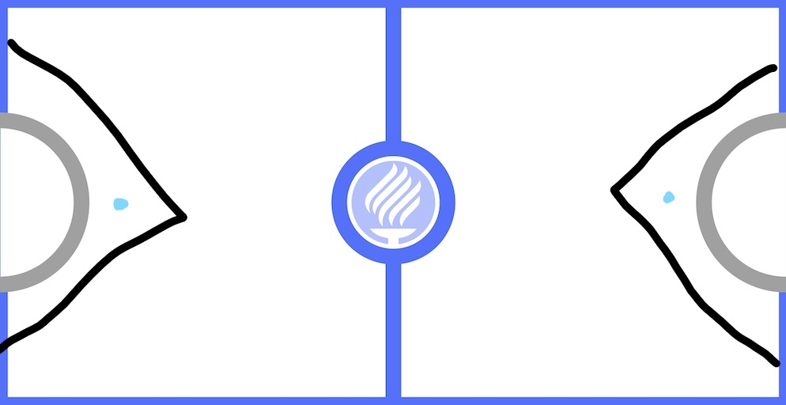

## Writeup for Air Hockey AI

#### Introduction

I wanted to work on a machine learning project, so I searched online and came across this [Github repository](https://github.com/leonardochang36/ai-airhockey).  As I scrolled through the code of all of the players, I saw that most of the players chose to hardcode their agents rather than using a machine learning model, which was surprising yet sad at the same time (even the winners of the competition had hardcoded the movements of the agent). *Fine, I'll do it myself.*

#### Brainstorming

My initial thought process was to use reinforcement learning, more specifically using Q-learning, since I just used it some time before I worked on my air hockey AI.

At first, my state space included:

* Initial position of paddle
* Position of puck
* Speed of puck

The position of the paddle will always be within a rectangle of 230 * 448 pixels directly in front of the goal. The action of the agent would be its velocity from its initial position at the point in time where the agent needs to make a move. However, since this is a simulation and not real life, we technically do not have to calculate the velocity which complicates a lot of things. Instead, final position of the paddle would suffice as the action that the agent needs to take, since this is also what we need to return to the GameCore.

I made a q-table by discretising the state-action pairs by rounding off position of paddle to the nearest 4, position of puck to nearest 5 and speed of puck to nearest 25. I set the size of the replay memory to be 120, and utilised epsilon-greedy policy to train the agent. The results were disappointing. The agent could not move much from the starting position, let alone block the puck or serve. I noticed afterwards that in the original competition there was only one team that used q-learning, and that team got *obliterated*. I gave up on using reinforcement learning, and the above state and action spaces for this problem soon after.

I stopped for a week to work on other matters, but I hoped to clean up the mess that I have created myself (I don't really like to give up on a challenge). During that week of absence, I did think of some interesting ideas, and used them for my new agent.

I had thought that the rectangular region of interest (ROI) I have set was insufficient as the puck may arrive from different angles and it may not be able to save the puck in certain circumstances. Instead, a triangular ROI which covers every possible direction at which the puck is shot would have been a better idea. This is as shown in the image below, where the agent's paddle would only be found along the black lines. The paddle would only move to the ROI when the direction of the puck is towards the paddle, and in other conditions the paddle would move to the point in cyan ink (this position allows it to transit to any point along the ROI as quickly as possible). Note that the paddle would not be able to enter the semicircle (goal area).

My state space this time includes:

* Position of puck
* Speed of puck

My action space this time includes:

* Next position of paddle

I had also wanted the agent to learn how to serve by itself, but chose to hardcode it in the end since there is still a relatively large probability that it does not serve.

At first, I continued to use epsilon-greedy policy to train the agent, but switched to a thrifty policy as there was no need to exploit during training since it does not derive its rewards from future actions like reinforcement learning. Moreover, more exploration allows it to reach more state-action pairs that it has not achieved previously, allowing the agent to converge faster.

To predict rewards earned by the agent for each action taken at each state, I have used supervised learning, or more specifically regression, during testing. I have tested most of the supervised learning algorithms available on the sklearn module.

Since supervised learning is used, there is no need to round off the states and actions to a large number such as 50 or 100 to minimise the number of state-action pairs available, as it is able to help us predict the reward for each action even if the agent has not experienced that state before. Instead, rounding off to nearest integer would do as I would prefer to avoid continuous values.

I have fixed reward for scoring to be 10 and -10 for my agent and for my opponent respectively. The reward for blocking can be changed through the SQL query provided by "edit rewards.sql".

#### Results and Analysis

Using linear models such as logistic regression often yielded the worst results, as the agent tends to believe that moving the paddle downwards is often the action that yields the highest score (for the first few hundred episodes), even in cases where the puck is moving upwards or just moving forwards in a straight line. About 1000 episodes and more, the agent that uses linear models would start to think that the best action to take most of the time is to move forward despite the puck moving from different positions at a variety of angles.

On the other hand, I find random forest the best supervised learning model, though its limitation would be that it requires more state-action pairs to reach results that are acceptable.

In the folder HISTORY_notDISCRETE_2000_EPOCH, it contains the experiences of my agent playing against itself for 2000 episodes, where it uses thrifty policy for training, state and actions are rounded off to the nearest integer, and reward for blocking is 8. This is done via shoeske_notDISCRETE.py. This is how my agent performed using shoeske_exploit_notDISCRETE.py by fitting the data into random forest regressor, where the rewards received for each state action pair is **not** averaged:

|          Player          |         Left         |        Right         |
| :----------------------: | :------------------: | :------------------: |
|  player_A (DREAM TEAM)   | 2-3, 2-4, 1-6 (LOSS) | 5-3, 5-2, 3-4 (LOSS) |
|   player_B (AIR KINGS)   | 7-4, 3-1, 5-1 (WIN)  | 5-4, 1-7, 4-5 (WIN)  |
| player_BLAZERS (BLAZERS) | 0-5, 0-3, 0-2 (LOSS) | 3-1, 3-0, 3-0 (LOSS) |

In the folder HISTORY_800_EPOCH, it contains the experiences of my agent playing against itself for 800 episodes, where it uses epsilon greedy policy for training, state and actions are approximated to a large extent, and reward for blocking is 5. This is done via shoeske.py.

In the folder HISTORY_against_player_A_500_EPOCH, it contains the experiences of my agent playing against player A for 500 episodes. While it occasionally wins against player A, it would lose utterly against other players such as player B.

#### Conclusion

This time, my ideas using machine learning may have lost to some hardcoded solution, but I hope that someone would rise up to the challenge and beat them using machine learning algorithms.

With that said, I may also try to revamp my reinforcement learning algorithm by using the improved state-action pairs in the future.